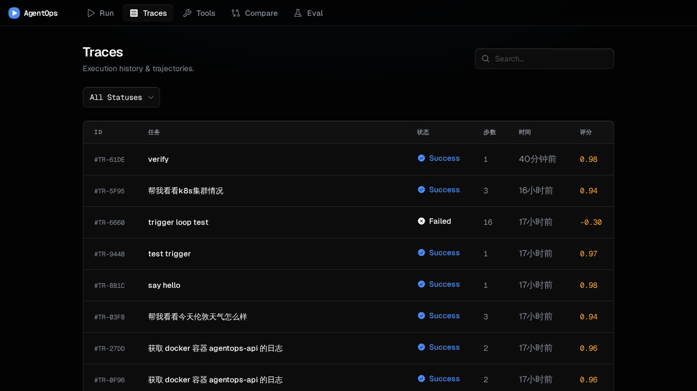
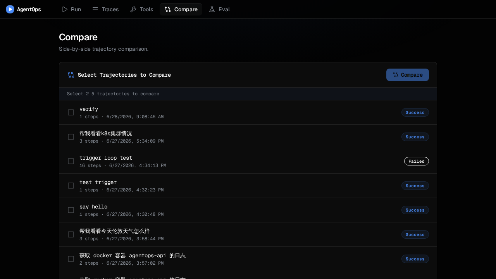
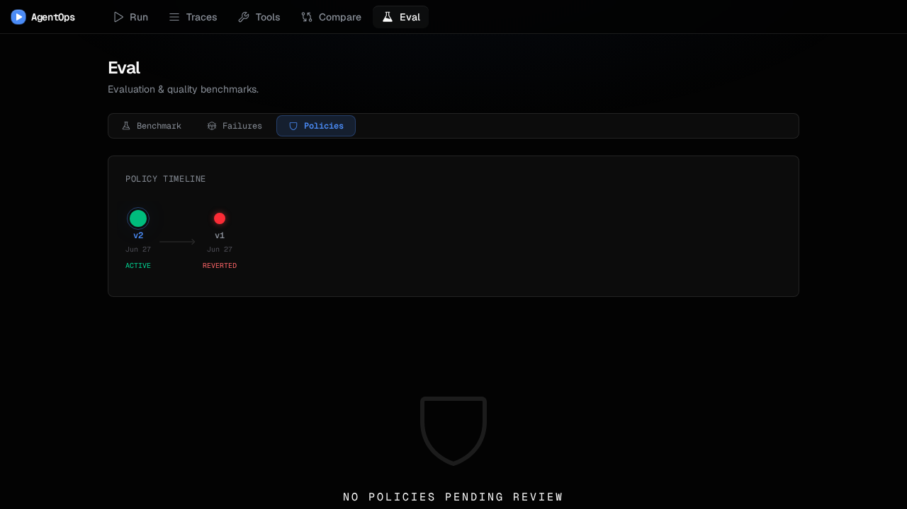
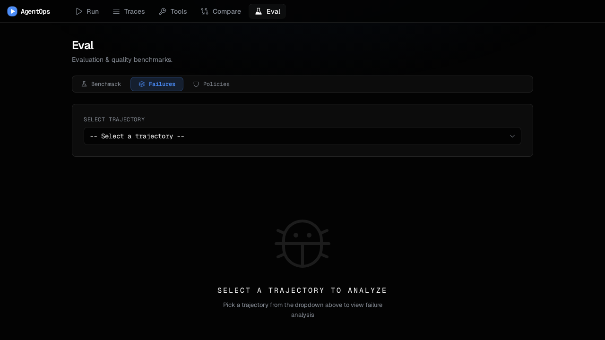

<p align="center">
  <a href="README.zh-CN.md">中文</a> |
  <a href="README.md">English</a>
</p>

<p align="center">
  
  
  
  
  
</p>

<h1 align="center">AgentOps Platform</h1>
<p align="center"><strong>AI Agent Infrastructure Platform</strong> — Task Execution → Trajectory Replay → Closed-Loop Optimization → Training Data Export</p>
<p align="center">A self-improving agent evaluation system that makes agents smarter as they run.</p>

---

## Preview

<p align="center">
  
  
</p>
<p align="center">
  
  
</p>

---

## Closed-Loop Optimization (v0.4)

The platform automatically discovers failure patterns, writes improvement policies, A/B tests them, and adopts or rolls back — all without human intervention.

```
Task → Run(Policy vN) → Trajectory → Score
  ↓
Failure Analyzer   → 4-dimension classification (Planning / Execution / Context / Budget)
  ↓
Policy Compiler    → Rule engine generates PolicyPatch (prompt_suffix / max_steps / strategy / tool_bias)
  ↓
Policy Store       → Versioned storage (v1→v2→v3) with human review queue
  ↓
Auto-replay        → Replay failed trajectories under new Policy → 3-tier evaluation (activate / rollback / review)
  ↓
Policy Router      → Injected into the next Agent execution
  ↓
[loop]
```

Trigger: ≥10 new trajectories or ≥30 minutes since last compilation. Policies are **prompt-level injections** (no model weight modification), compatible with any cloud LLM.

---

## Demo (Frontend Only)

Try the UI without a backend — deployed on Netlify with fully mocked data:

[**Live Demo →**](https://agentops-demo.netlify.app) *(replace with your actual URL after deploy)*

Or run locally without Docker:

```bash
cd frontend
VITE_MOCK_API=true pnpm dev
open http://localhost:5173
```

The mock layer intercepts all API calls at the JS level (RTK Query baseQuery + global fetch + simulated SSE stream) — no backend or database needed.

---

## Quick Start (Full Stack)

```bash
cp .env.example .env   # edit LLM_BASE_URL, LLM_API_KEY, LLM_MODEL
docker compose -f infra/docker/docker-compose.yml up -d
open http://localhost:5173
```

---

## Tech Stack

| Layer | Technology |
|-------|-----------|
| **Frontend** | React 19, TypeScript, Vite 6, Tailwind v4, Redux Toolkit, RTK Query, TanStack Table, framer-motion, Phosphor Icons, Recharts |
| **Backend** | Python 3.12, FastAPI, SQLAlchemy (async), asyncpg, docker-py, tiktoken, httpx |
| **Database** | PostgreSQL 16-alpine |
| **LLM** | OpenAI-compatible (DeepSeek / OpenAI / any compatible provider) |
| **Executor** | Docker SDK + Kubernetes Job (dual-mode) |
| **Testing** | pytest (96) + vitest (8) + Playwright E2E |
| **Deployment** | Docker Compose / kind K8s / Netlify (frontend demo) |

---

## Core Features

### Agent Runtime
- **ReAct Loop** — think → act → observe until final answer
- **SSE Streaming** — real-time step push to frontend
- **Policy Injection** — active Policy suffix / tool_bias / context_strategy / max_steps auto-injected
- **Multi-framework** — LangChain + OpenAI Agents SDK adapters
- **DeepSeek thinking mode** — full `reasoning_content` round-trip

### Closed-Loop Self-Improvement
- **Failure Analyzer** — 4-dimension multi-label classification, pure rule engine
- **Policy Compiler** — differentiated thresholds + 6 combined rules (C1-C6)
- **Policy Store** — UUID + auto-increment display dual-field versioning
- **Auto-replay** — replay failed trajectories, ≥10% activate / ≤-5% rollback
- **Auto-trigger** — event-driven (trajectory count) + time-driven (30min)
- **Human Review** — 3+ dimensions flagged → ReviewQueue → Approve / Reject

### Tool Execution
- Docker + K8s Job dual-mode executor with resource isolation
- Unified Tool Registry with online enable/disable
- MCP Server — Tool Registry → MCP JSON-RPC stdio transport

### Observability
- **Trajectory Replay** — play/pause/step/speed (0.5x–4x), keyboard shortcuts
- **Token Dashboard** — per-step prompt/completion tokens + context window bar
- **Multi-trace Compare** — independent column layout, tool differences highlighted

### Evaluation System
- **4D Scoring** — success + cost + latency + tool_failure
- **Benchmark** — asyncio.gather N concurrent runs, auto-ranked
- **Failure Charts** — Recharts radar + bar charts
- **Policy Timeline** — visual timeline, green/yellow/red status
- **Training Export** — OpenAI SFT / RLHF pairs / JSONL

### Design System
- Geist + Geist Mono fonts, dark theme (#030303)
- Cobalt blue (#4b8cf7) + Amber gold (#f5a623) dual accent
- State management: RTK Query → Redux → useState
- motion choreography + CSS timeline animations

---

## Project Structure

```
agent-ops-platform/
├── backend/
│   ├── app/
│   │   ├── main.py               # FastAPI routes + app entry
│   │   ├── orchestrator.py       # Agent dependency graph factory
│   │   ├── runtime.py            # ReAct loop + Policy injection
│   │   ├── agent_runner.py       # Agent lifecycle (score/cancel/closed-loop)
│   │   ├── failure_analyzer.py   # Failure analyzer (4-dimension rules)
│   │   ├── policy_compiler.py    # Policy compiler + PolicyPatch
│   │   ├── policy_store.py       # Policy CRUD + Policy type
│   │   ├── policy_pipeline.py    # Closed-loop entry: run_closed_loop
│   │   ├── auto_replay.py        # Auto-replay + 3-tier evaluation
│   │   ├── scoring.py            # Scoring engine (pure function)
│   │   ├── benchmarks.py         # Benchmark task definitions
│   │   ├── exporters.py          # Training data export
│   │   ├── llm.py                # LLM Provider adapter
│   │   ├── context_manager.py    # Context window + strategy
│   │   ├── trajectory_repo.py    # Trajectory CRUD
│   │   ├── models.py             # ORM (trajectories/steps/policies)
│   │   ├── config.py             # Config + closed-loop thresholds
│   │   └── serializer.py         # Serialization (render_scoring_view)
│   └── tests/                    # 96 tests
├── frontend/
│   ├── src/
│   │   ├── pages/
│   │   │   ├── RunPage.tsx           # Agent execution
│   │   │   ├── TraceListPage.tsx     # Trajectory list
│   │   │   ├── ComparePage.tsx       # Multi-trace comparison
│   │   │   ├── EvalPage.tsx          # Eval panel shell
│   │   │   └── eval/
│   │   │       ├── BenchmarkTab.tsx  # Benchmark + ranking
│   │   │       ├── FailuresTab.tsx   # Failure distribution charts
│   │   │       └── PoliciesTab.tsx   # Policy timeline + review queue
│   │   ├── components/              # 22+ UI components
│   │   ├── hooks/                   # usePolicyActions, useAgentStream...
│   │   └── services/                # RTK Query API
│   └── tests/                       # Playwright E2E
├── infra/                           # Docker Compose + K8s manifests
├── docs/                            # Design docs + screenshots
└── .scratch/                        # PRDs + issue tracking
```

---

## API

### Agent

| Method | Path | Description |
|--------|------|-------------|
| `POST` | `/api/agents/run` | Submit task (optional `policy_id`) |
| `GET` | `/api/agents/:id/stream` | SSE real-time stream |
| `POST` | `/api/agents/:id/cancel` | Cancel running task |

### Traces

| Method | Path | Description |
|--------|------|-------------|
| `GET` | `/api/traces` | List (`?status=&tool=`) |
| `GET` | `/api/traces/:id` | Detail + score + breakdown |
| `POST` | `/api/compare` | Multi-trajectory comparison |

### Tools

| Method | Path | Description |
|--------|------|-------------|
| `GET` | `/api/tools` | Tool directory |
| `PATCH` | `/api/tools/:name/toggle` | Enable/disable online |

### Evaluation & Analysis

| Method | Path | Description |
|--------|------|-------------|
| `POST` | `/api/eval/score` | Score trajectory (custom weights) |
| `POST` | `/api/eval/analyze` | Failure dimension analysis |
| `GET` | `/api/eval/analysis/summary` | Aggregated failure distribution |
| `GET` | `/api/eval/benchmarks` | Benchmark tasks |
| `POST` | `/api/eval/benchmark` | Run benchmark N-concurrently |
| `GET` | `/api/eval/export` | Export training data |

### Policy Management

| Method | Path | Description |
|--------|------|-------------|
| `GET` | `/api/eval/policies` | List all versions |
| `GET` | `/api/eval/policies/active` | Currently active policy |
| `GET` | `/api/eval/policies/:id` | Policy detail |
| `POST` | `/api/eval/policies/:id/approve` | Approve pending policy |
| `POST` | `/api/eval/policies/:id/reject` | Reject with reason |
| `POST` | `/api/eval/policies/compile` | Manual compile |
| `POST` | `/api/eval/policies/:id/replay` | Auto-replay |
| `GET` | `/api/eval/policies/warmup-status` | Cold-start progress |

---

## Testing

```bash
# Backend — 96 tests
cd backend && uv run pytest tests/ -v

# Frontend — 8 unit tests
cd frontend && pnpm vitest run

# TypeScript
cd frontend && npx tsc -b

# E2E (requires backend running)
cd frontend && pnpm playwright test
```

---

## License

MIT
