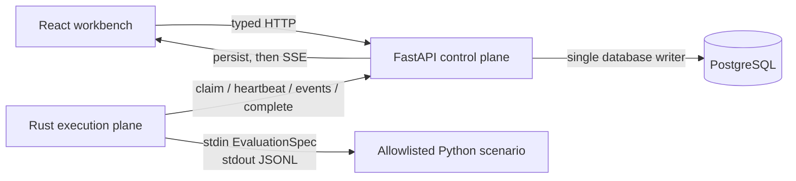

<p align="center">
  <a href="README.md">English</a> ·
  <a href="README.zh-CN.md">中文</a>
</p>

# AgentOps

**A full-stack evaluation workbench for running, diagnosing, improving, and validating tool-using AI agents.**

AgentOps turns one failed run into a reviewable improvement loop:

```text
Experiment → Baseline → Trace → Failure Analysis → Candidate Policy
           → Replay → Before / After → Human Activate or Reject
```

This repository is intentionally focused. Phase 1 proves one complete, deterministic loop instead of presenting unrelated infrastructure features.

## The 60-second demo

The built-in scenario investigates checkout API latency:

1. The baseline repeatedly fetches the same logs, exhausts its six-step budget, and fails.
2. The rule-based analyzer identifies **Planning** and **Budget** failures with event evidence.
3. AgentOps proposes a typed policy patch: avoid duplicate calls and check health, then metrics, then evidence-backed logs.
4. The same evaluation spec and seed are replayed through the Rust Runner.
5. The replay diagnoses the dependency issue in three steps and scores higher.
6. The candidate remains inert until a person selects **Activate** or **Reject**.

No LLM key or external service is required.

## Run the real stack

Requirements: Docker with Compose and Make.

```bash
cp .env.example .env
make demo
```

Open [http://localhost:5173](http://localhost:5173). The Golden loop normally completes in under 30 seconds.

```bash
make logs      # follow API, Runner, Web, and PostgreSQL
make down      # stop the stack
make test      # backend, frontend, Rust, and contract checks
```

## Live stack vs recorded preview

| Mode | Purpose | What runs |
|---|---|---|
| Local live stack | Real end-to-end behavior | React, FastAPI, PostgreSQL, Rust Runner, deterministic Python agent |
| Static preview | Vercel/Netlify portfolio preview | React plus recorded Golden E2E fixtures |

Start the static preview with:

```bash
cd frontend
npm ci
VITE_MOCK_API=true npm run dev
```

The UI displays **Recorded Demo Data** in this mode. Fixtures replay persisted events in order; they do not reimplement scoring, analysis, policy compilation, or state transitions in TypeScript.

## Architecture



| Layer | Responsibility |
|---|---|
| React + RTK Query | Experiment workflow, durable Trace, Analysis, Improve, replay comparison, human decision |
| FastAPI | Experiments, run and policy state machines, leases, persistence, scoring, analysis, SSE |
| Rust Runner | Process groups, heartbeat/cancel, timeout, bounded JSONL, event retry, terminal cleanup |
| PostgreSQL | Experiments, runs, jobs, ordered events, analyses, and policies |
| Python demo agent | One deterministic, allowlisted checkout-latency scenario |

Python Pydantic models own protocol v1. Versioned JSON Schemas and Golden fixtures live in [contracts/v1](contracts/v1); Rust Serde types validate those same fixtures in CI.

## Reliability and trust boundaries

- FastAPI is the only component that reads or writes PostgreSQL.
- Events are committed before they are published over SSE.
- Reconnects use `after=<sequence>`; `run_id + sequence` is unique and uploads are idempotent.
- Runner APIs require a bearer token and validate the runner identity, lease, and run.
- Expired leases cannot append events or complete a non-terminal run; repeated terminal completion remains idempotent.
- Jobs select an allowlisted `scenario_id`; API clients cannot provide an executable or shell command.
- Runner commands and arguments are separate. It never connects to Docker or the database.
- JSONL lines are capped at 64 KiB and combined output at 1 MiB by default.
- Linux/WSL jobs run in their own process group; cancellation sends SIGTERM, then SIGKILL after two seconds.
- Product events expose `decision_summary`, never hidden chain-of-thought.
- Policy activation always requires an explicit human action and a successful positive replay.

## Product surface

Only four routes form the Phase 1 product:

```text
/experiments
/experiments/new
/experiments/:experimentId
/runs/:runId?view=trace|analysis|improve
```

Run states are explicit: `queued`, `claimed`, `running`, `cancelling`, `succeeded`, `failed`, `cancelled`, and `timed_out`.

## Repository map

```text
backend/      FastAPI control plane, Alembic migration, deterministic agent
frontend/     React workbench and recorded-preview adapter
runner/       Rust workspace: protocol, runner, and CLI
contracts/    Versioned JSON Schemas and cross-language Golden fixtures
infra/docker/ Focused local Compose stack
scripts/      Real-stack Golden E2E
docs/adr/     Architecture decisions
.scratch/     Phase 1 PRD and issue records
```

## Verification

```bash
make check-contracts
make test-backend
make test-frontend
make test-rust

# Against a running real stack
python3 scripts/golden_e2e.py
```

CI covers Python, migrations, TypeScript, recorded-preview contracts, Rust protocol/process supervision, Compose validation, and the real Golden loop.

## Deliberate non-goals

Phase 1 has no Kubernetes executor, Docker socket, MCP server, vector memory, training export, framework adapters, real model provider, arbitrary code execution, accounts, multi-tenancy, billing, or automatic policy activation.

Those features return only when a measured product requirement justifies them. The next planned work is Runner recovery and a real OpenAI-compatible provider; see [.scratch/focused-closed-loop/PRD.md](.scratch/focused-closed-loop/PRD.md).

## Why this project exists

AgentOps is a portfolio project for full-stack and AI-native engineering roles. Its main claim is not feature count; it is a reviewable systems loop across product UX, durable streaming, state-machine invariants, typed cross-language contracts, and safe Rust process supervision.

## License

MIT
