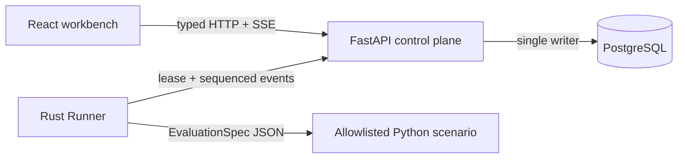
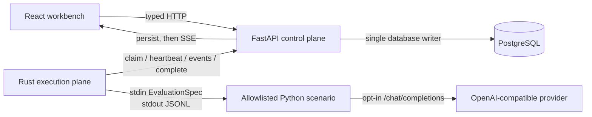

<p align="center">
  <a href="README.md">English</a> ·
  <a href="README.zh-CN.md">中文</a>
</p>

# AgentOps Workbench

**A portfolio-grade closed-loop evaluation workbench for tool-using agents** — run an Experiment, inspect the durable Trace, diagnose failure, replay a candidate Policy, and decide whether to activate it. The repo name is `agent-ops-platform`; **AgentOps Workbench** is the product qualifier so this project is not confused with the unrelated [AgentOps-AI](https://github.com/AgentOps-AI/agentops) SDK or generic “agent ops” tooling.

Unlike Langfuse or Phoenix, which focus on tracing and eval datasets, this workbench ships the full **policy replay + human activation gate** loop — candidates never auto-apply.

```text
Experiment → Baseline → Trace → Failure Analysis → Candidate Policy
           → Replay → Before / After → Human Activate or Reject
```


```mermaid
flowchart LR
    UI["React workbench"] -->|"typed HTTP + SSE"| API["FastAPI control plane"]
    API -->|"single writer"| DB[("PostgreSQL")]
    Runner["Rust Runner"] -->|"lease + sequenced events"| API
    Runner -->|"EvaluationSpec JSON"| Agent["Allowlisted Python scenario"]
```

**Why this repo is different:** (1) **Lease recovery with attempt fencing** — a crashed Runner cannot strand a Run; a replacement claims with a new Attempt and resumes from the next event sequence. (2) **Cross-language contract v1** — Python Pydantic, TypeScript Zod, and Rust Serde validate the same golden fixtures in CI.

**Try it in 30 seconds:**

```bash
cp .env.example .env
make demo
```

Open [http://localhost:5173](http://localhost:5173) and walk the Golden loop: create an Experiment, watch the baseline fail, review Analysis, replay the candidate Policy, then Activate or Reject.

Phase 1 is complete (recovery, provider boundary, observability). **Phase 1.4 — Scenario onboarding** is in progress: multiple registered built-in Scenarios instead of one hard-coded demo. See [ROADMAP.md](ROADMAP.md).

## Deterministic Golden workflow

The built-in scenario investigates checkout API latency:

1. The baseline repeatedly fetches the same logs, exhausts its six-step budget, and fails.
2. The rule-based analyzer identifies **Planning** and **Budget** failures with event evidence.
3. AgentOps proposes a typed policy patch: avoid duplicate calls and check health, then metrics, then evidence-backed logs.
4. The same evaluation spec and seed are replayed through the Rust Runner.
5. The replay diagnoses the dependency issue in three steps and scores higher.
6. The candidate remains inert until a person selects **Activate** or **Reject**.

No LLM key or external service is required.

## Optional OpenAI-compatible provider

Fixture execution remains the default, deterministic CI and Golden path. An Experiment may instead select `provider`; the API and browser still send only that mode. The Runner alone receives the operator configuration:

```bash
AGENTOPS_PROVIDER_BASE_URL=https://provider.example/v1
AGENTOPS_PROVIDER_API_KEY=replace-me
AGENTOPS_PROVIDER_MODEL=checkout-model
AGENTOPS_PROVIDER_TIMEOUT_MS=10000
AGENTOPS_PROVIDER_MAX_RETRIES=1
```

With Compose, place these values in the ignored `.env` file and run `make demo`; only the `runner` service receives them. Select **OpenAI-compatible provider** when creating the Experiment. The Python boundary calls `/chat/completions`, permits only the three checkout fixture tools, honors timeout/retry/cancellation, and records safe model, latency, request-count, and token metrics. It never persists the credential, endpoint, or hidden reasoning. Missing or failed configuration produces a structured terminal Run error. CI uses a local fake compatible server; live-provider checks are explicitly opt-in.

## Run the real stack

Requirements: Docker with Compose and Make.

```bash
cp .env.example .env
make demo
```

Open [http://localhost:5173](http://localhost:5173). The Golden loop normally completes in under 30 seconds.

```bash
make logs      # follow API, Runner, and Web
make down      # stop the stack
make test      # backend, frontend, Rust, and contract checks
```

## Live stack vs recorded preview

| Mode | Purpose | What runs |
|---|---|---|
| Local live stack | Real end-to-end behavior | React, FastAPI, PostgreSQL, Rust Runner, fixture or opt-in provider-backed Python agent |
| Recorded preview | Offline UI development and deterministic regression checks | React plus recorded Golden E2E fixtures |

Start the recorded preview with:

```bash
cd frontend
npm ci
VITE_MOCK_API=true npm run dev
```

The UI displays **Recorded Demo Data** in this mode. Fixtures replay persisted events in order; they do not reimplement scoring, analysis, policy compilation, or state transitions in TypeScript.

## Architecture


```mermaid
flowchart LR
    UI["React workbench"] -->|"typed HTTP"| API["FastAPI control plane"]
    API -->|"single database writer"| DB[("PostgreSQL")]
    API -->|"persist, then SSE"| UI
    Runner["Rust execution plane"] -->|"claim / heartbeat / events / complete"| API
    Runner -->|"stdin EvaluationSpec<br/>stdout JSONL"| Agent["Allowlisted Python scenario"]
    Agent -->|"opt-in /chat/completions"| Provider["OpenAI-compatible provider"]
```

| Layer | Responsibility |
|---|---|
| React + RTK Query | Experiment workflow, durable Trace, Analysis, Improve, replay comparison, human decision |
| FastAPI | Experiments, run and policy state machines, leases, persistence, scoring, analysis, SSE |
| Rust Runner | Process groups, heartbeat/cancel, timeout, bounded JSONL, event retry, terminal cleanup |
| PostgreSQL | Experiments, runs, jobs, ordered events, analyses, and policies |
| Python agent | Deterministic fixture path plus a narrow, opt-in provider path for the same allowlisted checkout scenario |

Python Pydantic models own protocol v1. Versioned JSON Schemas and Golden fixtures live in [contracts/v1](contracts/v1); Rust Serde types validate those same fixtures in CI.

## Reliability and trust boundaries

- FastAPI is the only component that reads or writes PostgreSQL.
- Events are committed before they are published over SSE.
- Reconnects use `after=<sequence>`; `run_id + sequence` is unique and uploads are idempotent.
- Runner APIs require a bearer token and validate the runner identity, lease, and run.
- Expired leases cannot append events or complete a non-terminal run; repeated terminal completion remains idempotent.
- When a lease expires, the next authenticated claim increments the Attempt, fences the old lease, and resumes from the next event sequence.
- Jobs select an allowlisted `scenario_id`; API clients can select only `fixture` or `provider` execution and cannot provide an executable, shell command, provider URL, model, or credential.
- The Runner alone receives provider configuration. Provider calls are bounded, cancelable `/chat/completions` requests and can select only the checkout fixture tools.
- Latest-attempt Provider model identity, latency, request count, and token usage are persisted as Run metrics; credentials, endpoint values, and hidden reasoning are not.
- Runner commands and arguments are separate. It never connects to Docker or the database.
- JSONL lines are capped at 64 KiB and combined output at 1 MiB by default.
- Linux/WSL jobs run in their own process group; cancellation sends SIGTERM, then SIGKILL after two seconds.
- Product events expose `decision_summary`, never hidden chain-of-thought.
- Policy activation always requires an explicit human action and a successful positive replay.

## Product surface

Only four routes form the Phase 1 product:

```text
/experiments
/experiments/new
/experiments/:experimentId
/runs/:runId?view=trace|analysis|improve
```

Run states are explicit: `queued`, `claimed`, `running`, `cancelling`, `succeeded`, `failed`, `cancelled`, and `timed_out`.

## Repository map

```text
backend/      FastAPI control plane, Alembic migrations, fixture and provider Python agent
frontend/     React workbench and recorded-preview adapter
runner/       Rust workspace: protocol, runner, and CLI
contracts/    Versioned JSON Schemas and cross-language Golden fixtures
infra/docker/ Focused local Compose stack
scripts/      Real-stack Golden E2E
docs/adr/     Architecture decisions
ROADMAP.md    Current engineering milestones and promotion gates
```

## Verification

```bash
make check-contracts
make test-backend
make test-frontend
make test-rust

# Against a running real stack
python3 scripts/golden_e2e.py
```

CI covers Python, migrations, TypeScript, recorded-preview contracts, Rust protocol/process supervision, Compose validation, and the real Golden loop.

## Deliberate non-goals

Phase 1 has no Kubernetes executor, Docker socket, MCP server, vector memory, training export, framework adapters, user-supplied provider endpoints or credentials, arbitrary code execution, accounts, multi-tenancy, billing, or automatic policy activation.

Those capabilities remain deferred until a measured requirement promotes them. Phase 1.4 adds registered built-in Scenarios; see [ROADMAP.md](ROADMAP.md).

## Project direction

AgentOps is developed as a reliable closed-loop evaluation system. Work is prioritized by recoverable execution, durable state, explicit invariants, typed cross-language contracts, observable failures, and safe process supervision rather than by feature count.

## License

MIT
