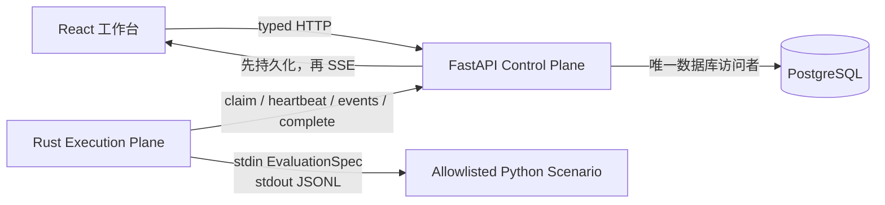

<p align="center">
  <a href="README.md">English</a> ·
  <a href="README.zh-CN.md">中文</a>
</p>

# AgentOps

**一个用于运行、诊断、改进和验证工具型 AI Agent 的全栈评测工作台。**

AgentOps 把一次失败执行变成可审查的改进闭环：

```text
Experiment → Baseline → Trace → Failure Analysis → Candidate Policy
           → Replay → Before / After → 人工 Activate 或 Reject
```

这个仓库刻意保持聚焦。Phase 1 的目标是证明一条完整、确定、可复现的闭环，而不是堆叠彼此无关的基础设施能力。

## 确定性 Golden 流程

内置场景用于调查 checkout API 延迟：

1. Baseline 重复读取相同日志，耗尽六步预算后失败。
2. 确定性规则分析器依据事件证据识别出 **Planning** 与 **Budget** 问题。
3. AgentOps 生成一个有类型约束的候选策略：禁止相同调用重复，依次检查 health、metrics 和证据相关 logs。
4. Rust Runner 使用相同 EvaluationSpec 和 Seed 发起 Replay。
5. Replay 用三步定位依赖异常，并得到更高分数。
6. Candidate 不会自动生效，必须由人选择 **Activate** 或 **Reject**。

整个流程不需要 LLM Key，也不依赖外部服务。

## 启动真实闭环

需要 Docker Compose 与 Make。

```bash
cp .env.example .env
make demo
```

打开 [http://localhost:5173](http://localhost:5173)。Golden 闭环通常会在 30 秒内完成。

```bash
make logs      # 查看 API、Runner 与 Web 日志
make down      # 停止完整环境
make test      # 后端、前端、Rust 与契约测试
```

## 真实环境与录制预览

| 模式 | 用途 | 实际运行内容 |
|---|---|---|
| 本地真实环境 | 验证完整端到端行为 | React、FastAPI、PostgreSQL、Rust Runner、确定性 Python Agent |
| Recorded Preview | 离线 UI 开发与确定性回归检查 | React 与 Golden E2E 录制 fixtures |

启动 Recorded Preview：

```bash
cd frontend
npm ci
VITE_MOCK_API=true npm run dev
```

此模式会持续显示 **Recorded Demo Data**。Fixture 只按时间顺序回放真实闭环中持久化的事件，不会在 TypeScript 中重新实现评分、分析、策略编译或状态机。

## 架构



| 层 | 职责 |
|---|---|
| React + RTK Query | Experiment 流程、可恢复 Trace、Analysis、Improve、Replay 对比与人工决策 |
| FastAPI | Experiment、Run/Policy 状态机、Lease、持久化、评分、分析和 SSE |
| Rust Runner | 进程组、Heartbeat/Cancel、Timeout、有界 JSONL、事件重试和退出清理 |
| PostgreSQL | Experiment、Run、Job、有序事件、Analysis 与 Policy |
| Python Demo Agent | 唯一确定、在白名单内的 checkout latency 场景 |

Python Pydantic 类型是协议 v1 的事实来源。版本化 JSON Schema 与 Golden fixtures 位于 [contracts/v1](contracts/v1)，Rust Serde 类型在 CI 中验证同一批 fixtures。

## 可靠性与安全边界

- FastAPI 是 PostgreSQL 的唯一读写者。
- RunEvent 提交成功后才会通过 SSE 发布。
- 重连使用 `after=<sequence>`；`run_id + sequence` 唯一，重复上传幂等。
- Runner API 使用 Bearer Token，并校验 runner identity、lease 与 run。
- 过期 Lease 不能继续上报或完成非终态任务；终态重复完成仍保持幂等。
- Lease 过期后，下一次认证 claim 会递增 Attempt、隔离旧 Lease，并从下一个事件 Sequence 继续。
- Job 只包含白名单 `scenario_id`，API 用户不能提交 executable 或 shell 命令。
- Runner 分离 command 与 args，不连接 Docker daemon，也不直连数据库。
- JSONL 单行默认最多 64 KiB，总输出默认最多 1 MiB。
- Linux/WSL 子进程运行在独立进程组；取消时先 SIGTERM，两秒后 SIGKILL。
- 产品事件仅展示 `decision_summary`，不记录或暗示隐藏 Chain-of-Thought。
- Policy 必须在 Replay 成功且分数提升后，由人显式激活。

## 产品范围

Phase 1 只保留四个产品路由：

```text
/experiments
/experiments/new
/experiments/:experimentId
/runs/:runId?view=trace|analysis|improve
```

Run 状态明确区分 `queued`、`claimed`、`running`、`cancelling`、`succeeded`、`failed`、`cancelled` 和 `timed_out`。

## 仓库结构

```text
backend/      FastAPI Control Plane、Alembic、确定性 Agent
frontend/     React 工作台与 Recorded Preview Adapter
runner/       Rust workspace：protocol、runner、CLI
contracts/    版本化 JSON Schema 与跨语言 Golden fixtures
infra/docker/ 聚焦后的本地 Compose 环境
scripts/      真实环境 Golden E2E
docs/adr/     架构决策
ROADMAP.zh-CN.md 当前工程里程碑与能力提升门槛
```

## 验证

```bash
make check-contracts
make test-backend
make test-frontend
make test-rust

# 面向已启动的真实环境
python3 scripts/golden_e2e.py
```

CI 覆盖 Python、数据库迁移、TypeScript、Recorded Preview 契约、Rust 协议与进程监督、Compose 配置，以及真实 Golden 闭环。

## 明确不做

Phase 1 不包含 Kubernetes Executor、Docker Socket、MCP Server、向量记忆、Training Export、多框架适配、真实模型 Provider、任意代码执行、账户、多租户、计费或自动激活 Policy。

这些能力继续暂缓，只有可量化需求才能将其提升到主线。当前优先级是真实 OpenAI-compatible Provider 和运维加固，详见 [ROADMAP.zh-CN.md](ROADMAP.zh-CN.md)。

## 项目方向

AgentOps 将持续打磨为可靠的闭环评测系统。工程优先级由可恢复执行、持久状态、明确不变量、跨语言类型契约、可观测故障和安全进程监督决定，而不是由功能数量决定。

## License

MIT
