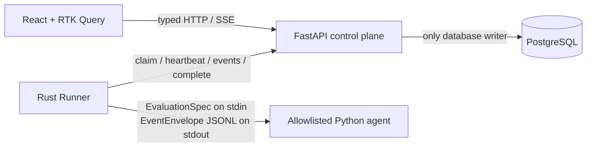

# AgentOps Closed-Loop Architecture

Status: current for Phase 1
Last reviewed: 2026-07-17

## System goal

AgentOps evaluates one agent configuration, explains a failed run, proposes a bounded policy change, replays the same evaluation input, and leaves activation to a person:

```text
Experiment → Baseline → Persisted Trace → Failure Analysis
           → Candidate Policy → Replay → Comparison → Human Activate or Reject
```

The current system is a focused evaluation control plane, not a generic orchestration platform. `backend/app/main.py` exports the Phase 1 application from `phase1_main.py`; `legacy_main.py` and the older executor, auto-replay, MCP, memory, and export modules are not part of the active Phase 1 runtime. Future work is tracked in [ROADMAP.md](../ROADMAP.md).

## Implemented Phase 1

| Capability | Current implementation | Source of truth |
|---|---|---|
| Domain workflow | Experiment, baseline/replay Run, analysis, candidate/active Policy | `backend/app/phase1_service.py` |
| API and state transitions | Typed FastAPI routes and explicit errors | `backend/app/phase1_main.py` |
| Persistence | PostgreSQL models and Alembic migration | `backend/app/phase1_models.py`, `backend/alembic/` |
| Execution protocol | Versioned EvaluationSpec and EventEnvelope | `backend/app/phase1_schemas.py`, `contracts/v1/` |
| Process supervision | Rust claim/heartbeat loop, process groups, timeout, cancellation, bounded JSONL | `runner/crates/agentops-runner/` |
| Deterministic agent | Allowlisted checkout-latency baseline and replay behavior | `backend/app/demo_agent.py` |
| Product workflow | Experiments, Trace, Analysis, Improve, replay, activate/reject | `frontend/src/Phase1App.tsx` |
| Offline regression adapter | Recorded persisted facts validated through the frontend contract | `frontend/src/services/recorded/` |
| End-to-end verification | Real Compose stack and Golden closed-loop script | `infra/docker/docker-compose.phase1.yml`, `scripts/golden_e2e.py` |

## Component ownership



- React owns workflow presentation and client state. It does not score, compile policies, or advance server state machines.
- FastAPI owns domain state, leases, persistence, scoring, analysis, and policy decisions. It does not supervise child processes.
- The Rust Runner owns process lifecycle, bounded transport, retry, cancellation, and timeout. It does not access PostgreSQL or implement policy logic.
- PostgreSQL stores durable facts; SSE is a projection of committed RunEvents.
- The Python agent consumes an immutable EvaluationSpec and emits protocol events. It does not own Run lifecycle state.

## Closed-loop behavior

1. A user creates an Experiment with the allowlisted `checkout-api-latency` scenario.
2. FastAPI creates a queued baseline Run and RunnerJob.
3. A Rust Runner claims the Job under a lease and supervises the deterministic Python agent.
4. FastAPI validates and commits ordered events before notifying SSE clients.
5. Terminal processing calculates score and deterministic failure analysis.
6. A failed baseline produces a bounded candidate PolicyPatch.
7. A person starts Replay; the same scenario, task, seed, and limits are retained while the candidate patch is added.
8. A successful positive Replay validates the candidate.
9. A person activates or rejects the Policy. No policy activates automatically.

## Reliability properties already enforced

- `run_id + sequence` is unique and duplicate event uploads are idempotent.
- Repeated replay requests and repeated terminal completion return the existing result.
- Runner endpoints authenticate the Runner and validate lease ownership.
- Expired leases cannot append events or mutate non-terminal Runs.
- Commands and arguments remain separate; API clients cannot submit an executable or shell command.
- JSONL line and combined-output limits are bounded.
- Linux/WSL child processes run in their own process group and receive SIGTERM before SIGKILL.
- Protocol v1 fixtures are validated by Python and Rust; frontend live and recorded paths share Zod schemas.
- Recorded Preview replays persisted facts for offline development and regression testing; it does not reproduce backend business logic.

## Known boundary

A lease can expire, but a `claimed`, `running`, or `cancelling` Run is not yet automatically recovered and reassigned. A real model provider is also not implemented; CI uses the deterministic allowlisted agent.

These are the next two milestones. Recovery semantics for partial traces must be decided in an ADR before implementation. See [ROADMAP.md](../ROADMAP.md).

## Deliberately deferred

Kubernetes execution, Docker socket access, MCP transport, vector memory, training export, framework adapters, arbitrary code execution, accounts, multi-tenancy, billing, and automatic policy activation are not part of the active architecture. Promotion requires a measured need, a roadmap update, and an ADR when trust boundaries change.
